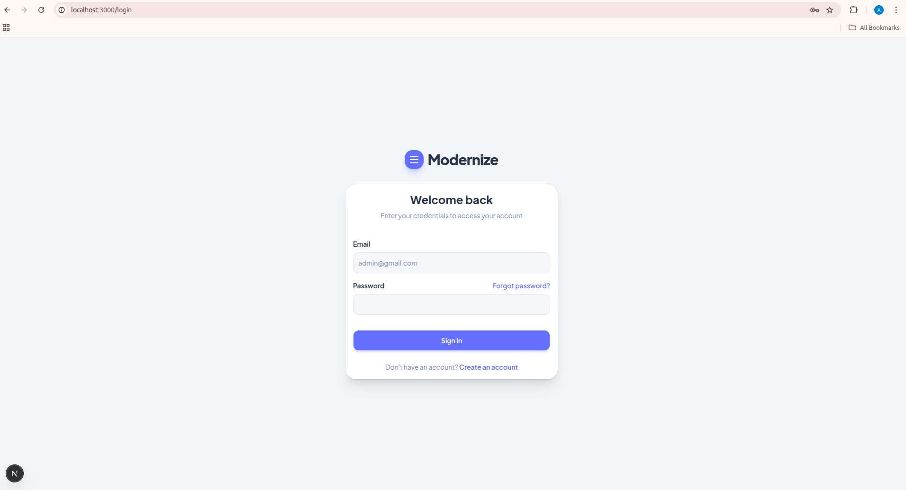
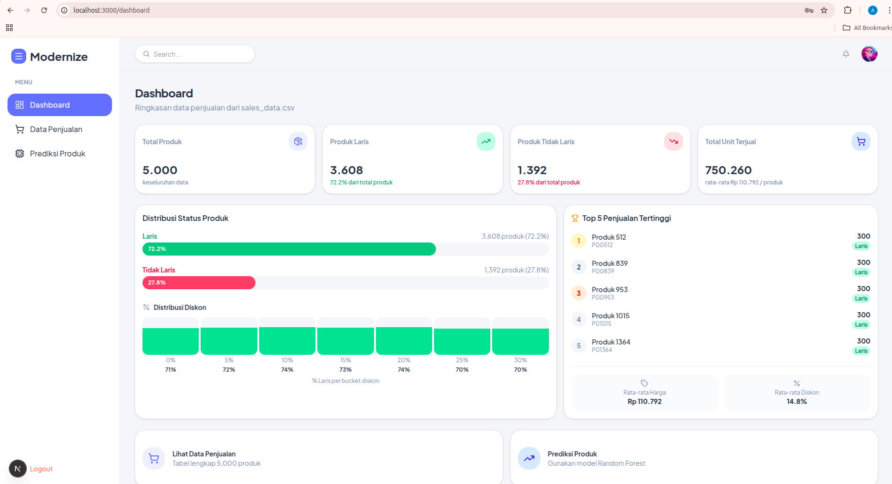
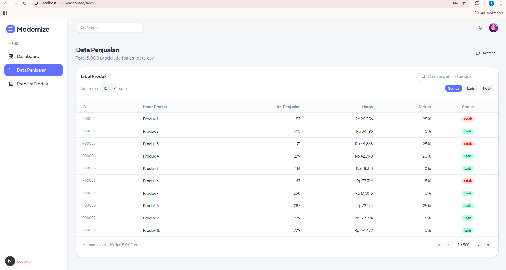
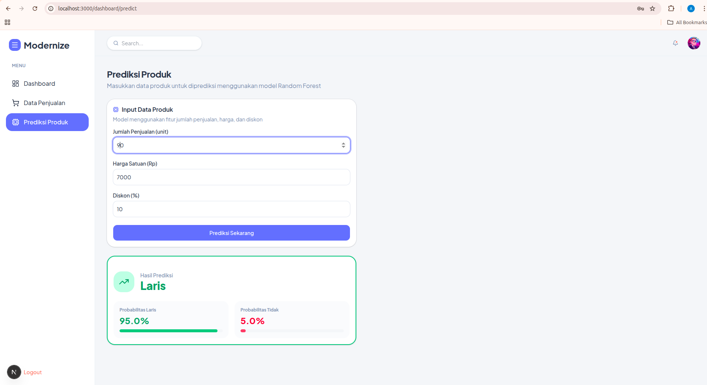

# Mini AI Sales Prediction System

Sistem prediksi status produk (Laris / Tidak Laris) berbasis Machine Learning dengan dashboard interaktif.

---

## Screenshot

### Login


### Dashboard


### Data Penjualan


### Prediksi Produk


---

## Arsitektur Sistem

```
┌─────────────────┐        ┌──────────────────────┐         ┌─────────────────┐
│   Frontend      │  HTTP  │   Backend (FastAPI)   │  load  │   ML Model      │
│   Next.js 16    │◄──────►│   REST API + JWT      │◄──────►│   model.pkl     │
│   Port 3000     │        │   Port 8000           │        │   Random Forest │
└─────────────────┘        └──────────┬───────────┘         └─────────────────┘
                                       │ read
                                       ▼
                              ┌─────────────────┐
                              │  data/          │
                              │  sales_data.csv │
                              │  (5000 rows)    │
                              └─────────────────┘
```

**Alur data:**
1. CSV dibaca saat training ML → model disimpan sebagai `model.pkl`
2. Backend memuat `model.pkl` saat startup
3. Frontend login → dapat JWT token (disimpan di cookie)
4. Frontend `GET /api/sales` → tabel data penjualan dari CSV
5. Frontend `POST /api/predict` → backend kirim input ke model → balikan Laris/Tidak

---

## Struktur Project

```
Goodeva/
├── backend/
│   ├── app/
│   │   ├── auth/
│   │   │   ├── router.py       # POST /api/login
│   │   │   ├── schemas.py      # LoginRequest, TokenResponse
│   │   │   └── utils.py        # JWT create/verify, dummy user
│   │   ├── sales/
│   │   │   ├── router.py       # GET /api/sales (pagination + search + filter)
│   │   │   ├── schemas.py      # SalesItem, SalesResponse
│   │   │   └── stats.py        # GET /api/stats (ringkasan dashboard)
│   │   ├── predict/
│   │   │   ├── router.py       # POST /api/predict
│   │   │   └── schemas.py      # PredictRequest, PredictResponse
│   │   ├── config.py           # Settings dari .env
│   │   └── main.py             # FastAPI app, CORS, register router
│   ├── .env
│   └── requirements.txt
├── frontend/
│   └── src/
│       ├── app/
│       │   ├── dashboard/
│       │   │   ├── page.tsx         # Dashboard utama (stat cards + chart)
│       │   │   ├── sales/page.tsx   # Tabel data penjualan
│       │   │   └── predict/page.tsx # Form prediksi produk
│       │   └── login/page.tsx
│       ├── components/
│       │   └── layout/
│       │       ├── DashboardLayout.tsx
│       │       ├── Navbar.tsx
│       │       └── Sidebar.tsx
│       ├── lib/
│       │   ├── api.ts          # HTTP client + type definitions
│       │   └── utils.ts
│       └── proxy.ts            # Auth guard (redirect jika belum login)
├── ml/
│   ├── train.py                # Script training Random Forest
│   ├── model.pkl               # Model tersimpan (hasil training)
│   └── label_encoder.pkl       # Encoder Laris/Tidak
├── data/
│   └── sales_data.csv          # Dataset 5000 produk
├── image/
│   ├── login.png
│   ├── dashboard.png
│   ├── data_penjualan.png
│   └── prediksi_produk.png
└── README.md
```

---

## Cara Menjalankan

### Prasyarat

| Tool | Versi minimum |
|------|--------------|
| Python | 3.10+ |
| Node.js | 18+ |
| npm | 9+ |

---

### 1. Masuk ke folder project

```bash
cd Goodeva
```

---

### 2. ML — Training Model (sekali saja)

```bash
cd backend
python3 -m venv venv
source venv/bin/activate        # Linux/Mac
# venv\Scripts\activate         # Windows

pip install -r requirements.txt

cd ..
python ml/train.py
```

Output yang diharapkan:

```
Classes: ['Laris', 'Tidak']
Accuracy : 1.0000 (100.00%)
Model saved  → ml/model.pkl
Encoder saved → ml/label_encoder.pkl
```

> Langkah ini **tidak perlu diulang** kecuali dataset berubah. Jika `ml/model.pkl` sudah ada, lewati langkah ini.

---

### 3. Backend — FastAPI

```bash
cd backend
source venv/bin/activate        # Linux/Mac
# venv\Scripts\activate         # Windows

uvicorn app.main:app --reload --port 8000
```

- Backend → `http://localhost:8000`
- Swagger docs → `http://localhost:8000/docs`

---

### 4. Frontend — Next.js

Buka terminal baru:

```bash
cd frontend
npm install        # hanya pertama kali
npm run dev
```

- Frontend → `http://localhost:3000`

---

### 5. Login

Buka `http://localhost:3000` dan gunakan:

| Field | Value |
|-------|-------|
| Email | `admin@gmail.com` |
| Password | `admin123` |

---

## API Endpoints

Base URL: `http://localhost:8000`

| Method | Endpoint | Auth | Deskripsi |
|--------|----------|------|-----------|
| `POST` | `/api/login` | ✗ | Login, mendapat JWT token |
| `GET` | `/api/sales` | ✓ Bearer | Data penjualan (pagination, search, filter) |
| `GET` | `/api/stats` | ✓ Bearer | Ringkasan statistik untuk dashboard |
| `POST` | `/api/predict` | ✓ Bearer | Prediksi status produk |

### POST `/api/login`
```json
// Request
{ "email": "admin@gmail.com", "password": "admin123" }

// Response 200
{ "access_token": "<jwt>", "token_type": "bearer" }
```

### GET `/api/sales`
```
Query params:
  page       integer  default: 1
  page_size  integer  default: 10, max: 100
  status     string   "Laris" | "Tidak"
  search     string   cari nama atau ID produk
```

### POST `/api/predict`
```json
// Request
{ "jumlah_penjualan": 150, "harga": 75000, "diskon": 10 }

// Response 200
{
  "status": "Laris",
  "probability_laris": 1.0,
  "probability_tidak": 0.0
}
```

---

## Machine Learning

| Item | Detail |
|------|--------|
| Model | Random Forest Classifier |
| Library | scikit-learn 1.4.2 |
| n_estimators | 100 trees |
| Fitur input | `jumlah_penjualan`, `harga`, `diskon` |
| Target | `status` (Laris / Tidak) |
| Train / Test split | 80% / 20% |
| Akurasi | 100% |

**Feature importance:**

| Fitur | Importance |
|-------|-----------|
| `jumlah_penjualan` | 98.8% |
| `harga` | 1.0% |
| `diskon` | 0.2% |

> Akurasi 100% terjadi karena dataset memiliki threshold yang sangat jelas — produk dengan `jumlah_penjualan ≥ 81` selalu Laris, `≤ 80` selalu Tidak Laris. Harga dan diskon tidak berpengaruh signifikan pada data ini.

---

## Design Decision

**1. Pemilihan model: Random Forest**
Dipilih karena tidak memerlukan feature scaling, robust terhadap outlier, dan menghasilkan feature importance secara otomatis. Lebih stabil dibanding single Decision Tree karena merupakan ensemble dari 100 tree yang menetralkan overfitting.

**2. JWT disimpan di cookie**
Bukan localStorage, agar `proxy.ts` (middleware Next.js) bisa membaca token server-side dan melakukan redirect sebelum halaman dirender — mencegah flash konten dashboard saat belum login.

**3. Server-side search & pagination**
Pencarian pada `/api/sales` dilakukan di backend (filter pandas DataFrame) agar mencakup seluruh 5000 baris, bukan hanya halaman yang sedang ditampilkan di frontend.

**4. `useTransition` untuk smooth pagination**
Saat ganti halaman tabel, data lama tetap terlihat (opacity-50) selama fetch berlangsung. Skeleton hanya ditampilkan pada load pertama, sehingga navigasi antar halaman terasa smooth tanpa flash.

**5. Lazy load model**
`model.pkl` dimuat saat request pertama ke `/api/predict` dan disimpan di memory proses. Request berikutnya langsung menggunakan model yang sudah dimuat tanpa overhead I/O.
